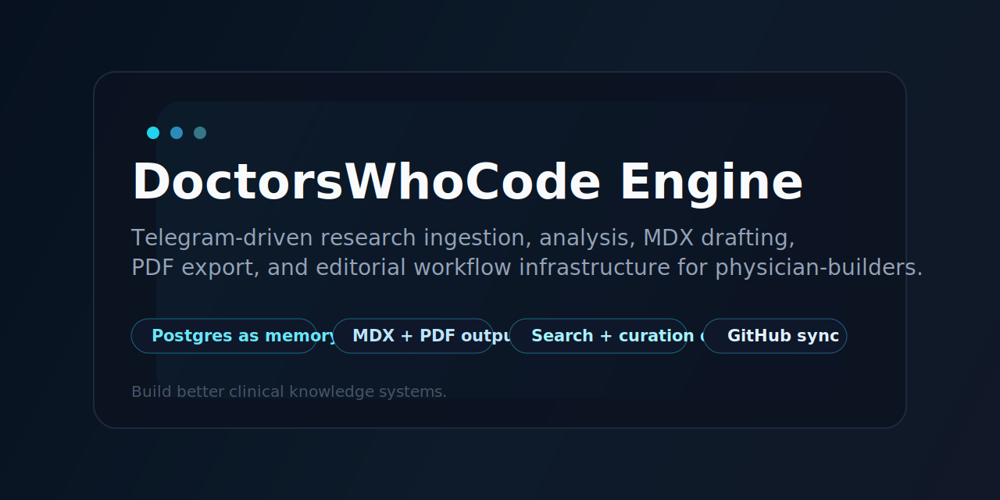

# DoctorsWhoCode Engine

Online-first research ingestion and publishing infrastructure for physician-builders.



DoctorsWhoCode Engine turns Telegram messages into durable research artifacts:

- source-aware digests
- archived research records
- structured summaries
- Astro-ready MDX drafts
- PDF exports
- GitHub-synced draft outputs

Live today: Telegram ingestion, YouTube transcript-backed analysis, Postgres memory, MDX draft generation, PDF export, GitHub draft sync, search, retrieval, and editorial queue workflows.

It is designed for real physician-builder workflows, not generic chat. A URL, PubMed article, YouTube video, transcript, or note comes in through Telegram. The engine classifies it, normalizes it, analyzes it, stores it in Postgres, and turns it into something reusable.

## Getting Started

### What you can do right now

- send `digest <url>` to get a quick source-aware summary
- send `file PMID:<id>` to archive a paper
- send `mdx <record-id>` to turn a saved record into an Astro draft
- send `pdf <record-id>` to export a PDF and get it back in Telegram
- use `find`, `recent`, `queue`, and `mark` to operate the editorial pipeline

### Fast local setup

```bash
npm install
npm run dev
```

Required environment variables:

- `TELEGRAM_BOT_TOKEN`
- `OPENAI_API_KEY`
- `DATABASE_URL`
- `BASE_URL`

## Why This Exists

Most research workflows optimize for capture.

This project optimizes for conversion.

The problem is rarely a lack of information. The problem is that saved links, papers, transcripts, and notes never make it all the way to structured understanding, reusable knowledge, or publishable output. DoctorsWhoCode Engine closes that gap.

## Capabilities

### Inputs

- plain text
- webpage URLs
- PubMed IDs
- PubMed URLs
- YouTube URLs
- pasted transcripts
- upstream audio transcripts

### Outputs

- `digest`
- `file`
- `summarize`
- `mdx`
- `pdf`

### Storage and retrieval

- canonical storage in Postgres
- retrieval by record ID
- recent-item listing
- search across saved records
- curation states and editorial queue views

### Publishing

- MDX draft generation
- GitHub draft sync
- PDF export on demand
- PDF delivery back into Telegram

## How It Works

```text
Telegram
  -> ingestion
  -> normalization
  -> source-aware analysis
  -> Postgres storage
  -> retrieval / curation
  -> MDX / PDF / GitHub outputs
```

Every inbound source is normalized before rendering.

That matters because a PubMed abstract is not the same as a full paper, a YouTube title is not the same as a transcript, and a transcript is not the same as a peer-reviewed article. The engine preserves that distinction and reflects it in the output.

## Core Principles

- Online-first persistence is the source of truth.
- Local files are export artifacts, not the canonical store.
- GitHub is for draft publishing and curated outputs.
- Inputs are normalized before any summary or draft generation occurs.
- Source completeness and provenance are always part of the result.

## Stack

- TypeScript
- Express
- Telegram Bot API
- OpenAI
- PostgreSQL
- Railway
- GitHub
- Astro / MDX
- `pdf-lib`

## Current Capabilities

### Research ingestion

- Telegram webhook processing
- canonical command parsing
- natural-language intent inference
- URL ingestion for accessible pages
- PubMed ingestion
- YouTube deep analysis with transcript fallbacks

### Research memory

- canonical Postgres record storage
- `show <id>`
- `recent`
- `find` / `search`

### Editorial workflow

- curation states:
  - `new`
  - `reviewed`
  - `drafted`
  - `publish_ready`
  - `archived`
- queue views
- promotion / demotion commands
- compound analyze-and-draft workflows

### Publishing workflow

- MDX on demand from saved records
- DoctorsWhoCode voice-tuned MDX drafting
- GitHub draft sync
- PDF on demand from saved records

## Commands

### Canonical actions

- `digest <input>`
- `file <input>`
- `summarize <input>`
- `mdx <input>`
- `pdf <record-id>`

### Retrieval

- `show <record-id>`
- `retrieve <record-id>`
- `recent`
- `recent 5`
- `recent pubmed`
- `find cerclage`
- `search physician-builder`

### Curation

- `mark <id> reviewed`
- `mark <id> drafted`
- `mark <id> publish_ready`
- `mark <id> archived`
- `promote <id> publish_ready`
- `demote <id> reviewed`

### Queue views

- `queue`
- `queue reviewed`
- `queue drafted`
- `queue publish_ready`
- `queue blog`
- `queue youtube drafted`

### Compound workflows

- `draft <url-or-source>`
- `analyze and draft <url-or-source>`
- `queue for blog <url-or-source>`

## Example Workflow

### Quick digest

```text
digest https://example.com/article
```

### Archive a paper

```text
file PMID:39371694
```

### Deep YouTube analysis

```text
What can a doctor who codes take away from this? As a cautionary tale https://youtu.be/...
```

### Generate an MDX draft from a saved record

```text
mdx 00bbfa8e03e87849
```

### Export a saved record to PDF

```text
pdf 00bbfa8e03e87849
```

## HTTP Endpoints

- `GET /health`
- `POST /telegram/webhook`
- `POST /ingest`

The `/ingest` endpoint is mainly for local debugging.

Example:

```json
{
  "text": "digest https://example.com/article"
}
```

## Local Development

### 1. Install dependencies

```bash
npm install
```

### 2. Create environment variables

Copy `.env.example` to `.env` and set:

- `TELEGRAM_BOT_TOKEN`
- `OPENAI_API_KEY`
- `DATABASE_URL`
- `BASE_URL`

Optional:

- `OPENAI_MODEL`
- `OPENAI_TIMEOUT_MS`
- `SUPADATA_API_KEY`
- `FETCHTRANSCRIPT_API_KEY`
- `GITHUB_TOKEN`
- `GITHUB_REPO`
- `GITHUB_BRANCH`
- `PORT`

### 3. Run locally

```bash
npm run dev
```

### 4. Build

```bash
npm run build
```

## Deployment Notes

This project is designed to run well on Railway.

- Railway app service hosts the TypeScript service
- Railway Postgres stores canonical records
- Telegram points to the Railway webhook
- GitHub is used for draft-sync publishing outputs

Important architectural note:

- Postgres is the canonical memory layer
- local filesystem writes are exports only

## Storage Layout

Even though Postgres is canonical, the engine also writes export artifacts to predictable folders:

- `archive/records/`
- `archive/sources/`
- `archive/summaries/`
- `archive/transcripts/`
- `content/blog/`
- `output/pdf/`

## Source Handling Notes

- webpage extraction currently uses `r.jina.ai`
- PubMed extraction uses NCBI E-utilities
- YouTube uses local transcript retrieval first, then hosted fallback providers
- Telegram replies are chunked for message-size safety
- deep analyses are compressed for chat while full outputs are preserved in storage

## Roadmap Status

This repo is already beyond scaffold stage.

Implemented:

- live Telegram ingestion
- Postgres-backed canonical storage
- search and retrieval
- YouTube transcript-backed analysis
- MDX generation
- GitHub draft sync
- PDF export
- editorial curation workflow

Active next direction:

- stronger queue intelligence
- more refined search and ranking
- better publishing workflows
- continued output and voice tuning

See [ROADMAP.md](./ROADMAP.md), [TODO.md](./TODO.md), [PHASE-3-PLAN.md](./PHASE-3-PLAN.md), and [PHASE-3E-YOUTUBE-DEEP-ANALYSIS.md](./PHASE-3E-YOUTUBE-DEEP-ANALYSIS.md).

## Repository Suggestions

Suggested GitHub repository description:

> Telegram-driven research ingestion, analysis, MDX drafting, PDF export, and editorial workflow infrastructure for physician-builders.

Suggested About text:

> Online-first research pipeline for physician-builders. Send links, papers, PubMed records, and YouTube videos through Telegram, then turn them into searchable records, MDX drafts, PDFs, and curated publish workflows.

Suggested Website:

> `https://doctorswhocode-engine-production.up.railway.app`

Suggested social preview image:

> `docs/social-preview.svg`

Suggested topics:

- `typescript`
- `telegram-bot`
- `research-workflow`
- `mdx`
- `astro`
- `postgres`
- `railway`
- `openai`
- `pubmed`
- `youtube-transcript`
- `knowledge-management`
- `physician-developer`
- `health-tech`
- `doctorswhocode`

## Philosophy

This is not a chatbot that happens to summarize links.

It is a physician-builder research pipeline built to make insight durable, queryable, and publishable.
